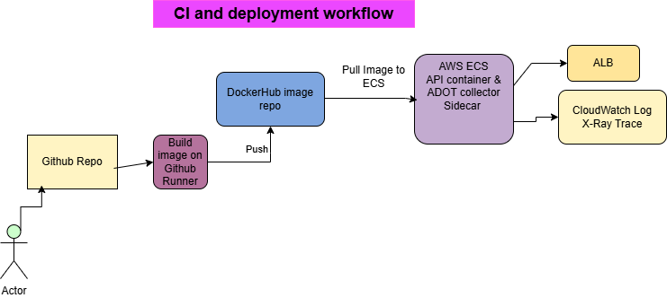

Build ECS infrastructure with ADOT sidecar container to send trace to X-Ray and log to CloudWatch.
Terraform code available on terraform folder.
Write Dockerfile to build container image:

FROM python:3.11-slim

WORKDIR /app

# Install system dependencies (IMPORTANT)
RUN apt-get update && apt-get install -y \
    build-essential \
    gcc \
    curl \
    && rm -rf /var/lib/apt/lists/*

COPY requirements.txt .

RUN pip install --no-cache-dir -r requirements.txt

# AWS Auto-Instrumentation
ENV OTEL_PYTHON_DISTRO="aws_distro"
ENV OTEL_PYTHON_CONFIGURATOR="aws_configurator"

# EXPLICITLY set PYTHONPATH to the current directory
ENV PYTHONPATH=/app/src

COPY . .

ENV DATABASE_URL=sqlite+aiosqlite:///./test.db
ENV OTEL_PYTHON_DISTRO="aws_distro"
ENV OTEL_PYTHON_CONFIGURATOR="aws_configurator"

EXPOSE 8000
CMD ["opentelemetry-instrument", "uvicorn", "src.main:app", "--host", "0.0.0.0", "--port", "8000"]

Build, push to DockerHub, and update docker image after any changes push to github repo. Here is the GitHub Action yaml. 
name: Build and Push Docker Image

on:
  push:
    branches:
      - main          # triggers on push to main
  pull_request:
    branches:
      - main          # builds but does NOT push on PR

jobs:
  build-and-push:
    name: Build and Push to DockerHub
    runs-on: ubuntu-latest
    outputs:
      # Extract only the short SHA tag for deployment
      short_sha: ${{ steps.meta.outputs.version }}
  
    steps:
      # ── Step 1: Checkout code ──────────────────────────────────────────────
      - name: Checkout Repository
        uses: actions/checkout@v4
  
      # ── Step 2: Set up Docker Buildx ──────────────────────────────────────
      - name: Set up Docker Buildx
        uses: docker/setup-buildx-action@v3
  
      # ── Step 3: Login to DockerHub ─────────────────────────────────────────
      - name: Login to DockerHub
        if: github.event_name == 'push'   # only login on push not PR
        uses: docker/login-action@v3
        with:
          username: ${{ secrets.DOCKERHUB_USERNAME }}
          password: ${{ secrets.DOCKERHUB_TOKEN }}
   
      # ── Step 4: Extract metadata (tags & labels) ───────────────────────────
      - name: Extract Docker Metadata
        id: meta
        uses: docker/metadata-action@v5
        with:
          images: ${{ secrets.DOCKERHUB_USERNAME }}/fastapi-hero
          tags: |
            type=sha,prefix=,suffix=,format=short
            type=raw,value=latest 
      
      # ── Step 5: Build and Push ─────────────────────────────────────────────
      - name: Build and Push Docker Image
        uses: docker/build-push-action@v5
        with:
          context: .
          file: ./Dockerfile
          push: ${{ github.event_name == 'push' }}  # only push on push event
          tags: ${{ steps.meta.outputs.tags }}
          labels: ${{ steps.meta.outputs.labels }}
          cache-from: type=gha      # GitHub Actions cache
          cache-to: type=gha,mode=max
  
      # ── Step 6: Print image digest ─────────────────────────────────────────
      - name: Print Image Digest
        run: echo "Image pushed ${{ steps.meta.outputs.tags }}"
  deploy:
    name: Deploy to Amazon ECS
    needs: build-and-push
    if: github.event_name == 'push' # Only deploy when pushing to main
    runs-on: ubuntu-latest
    steps:
      - name: Checkout
        uses: actions/checkout@v4

      - name: Configure AWS credentials
        uses: aws-actions/configure-aws-credentials@v4
        with:
          aws-access-key-id: ${{ secrets.AWS_ACCESS_KEY_ID }}
          aws-secret-access-key: ${{ secrets.AWS_SECRET_ACCESS_KEY }}
          aws-region: ${{ secrets.AWS_REGION }}
      - name: Download task definition 
        run: |
           run: |
            aws ecs describe-task-definition \
               --task-definition fastapi-hero \
               --query taskDefinition \
               --output json | jq 'del(.taskDefinitionArn, .revision, .status, .requiresAttributes, .compatibilities, .registeredAt, .registeredBy)' > task-definition.json
      - name: Fill in the new image ID in the Amazon ECS task definition
        id: task-def
        uses: aws-actions/amazon-ecs-render-task-definition@v1
        with:
          task-definition: task-definition.json
          container-name: ${{ secrets.CONTAINER_NAME }}
          image: ${{ secrets.DOCKERHUB_USERNAME }}/fastapi-hero:${{ needs.build-and-push.outputs.short_sha }}

      - name: Deploy Amazon ECS task definition
        uses: aws-actions/amazon-ecs-deploy-task-definition@v1
        with:
          task-definition: ${{ steps.task-def.outputs.task-definition }}
          service: ${{ secrets.ECS_SERVICE }}
          cluster: ${{ secrets.ECS_CLUSTER }}
          wait-for-service-stability: true

Al assistants prompts share here:
https://aistudio.google.com/app/prompts?state=%7B%22ids%22%3A%5B%2213eHlztbolVECoD7Sg-Hgamt7i4qCZ7-Z%22%5D%2C%22action%22%3A%22open%22%2C%22userId%22%3A%22105018193118574696765%22%2C%22resourceKeys%22%3A%7B%7D%7D&usp=drive_link
https://aistudio.google.com/app/prompts?state=%7B%22ids%22%3A%5B%221dc7AOMwWu0DEaWWa5OE8MFuHjti200Bv%22%5D%2C%22action%22%3A%22open%22%2C%22userId%22%3A%22105018193118574696765%22%2C%22resourceKeys%22%3A%7B%7D%7D&usp=drive_link

